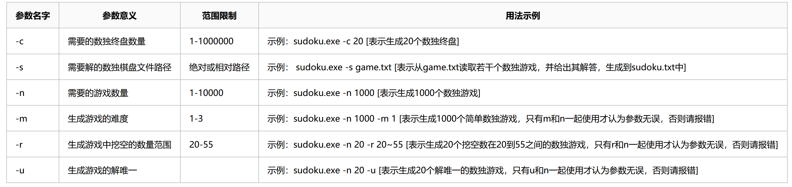
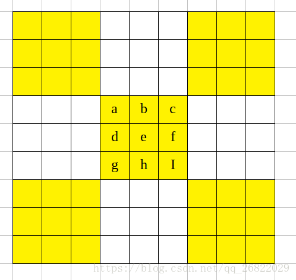
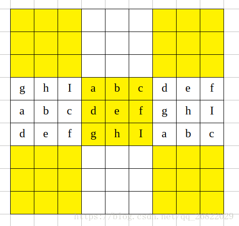
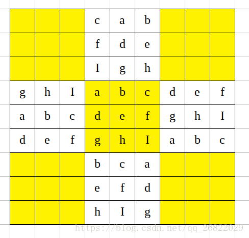
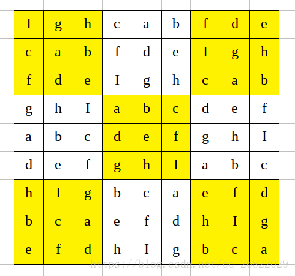

[TOC]

# 任务总体目标：实现一个能够生成数独游戏并求解数独问题的控制台程序

## 具体要求

- 采用 c++语言实现
- 能够生成数独，并存至文件
- 读取文件内的数独，求解并将结果输出至文件
- 命令行功能



---

# 具体实现

使用回溯算法完成数独的求解与生成。
GitHub 仓库 : [sudoku-player](https://github.com/psychopurp/sudoku-player)

## 数独的规则

数独的形式是下面这样的，一共有 81 个格子。

解数独时需要根据 9×9 盘面上的已知数字，推理出所有剩余空格的数字，并满足每一行、每一列、每一个粗线宫（3\*3）内的数字均含 1-9，不重复。

## 回溯算法

> 回溯法采用试错的思想，它尝试分步的去解决一个问题。在分步解决问题的过程中，当它通过尝试发现现有的分步答案不能得到有效的正确的解答的时候，它将取消上一步甚至是上几步的计算，再通过其它的可能的分步解答再次尝试寻找问题的答案。回溯法通常用最简单的递归方法来实现，在反复重复上述的步骤后可能出现两种情况：
>
> - 找到一个可能存在的正确的答案
> - 在尝试了所有可能的分步方法后宣告该问题没有答案

## 数独的解法

使用回溯算法来求解数独。

### 解数独思路

类似人的思考方式去尝试，行，列，还有 3\*3 的方格内数字是 1~9 不能重复。

我们尝试填充，如果发现重复了，那么擦除重新进行新一轮的尝试，直到把整个数组填充完成。

### 算法步骤

- 数独首先行，列，还有 3\*3 的方格内数字是 1~9 不能重复。
- 声明布尔数组，表明行列中某个数字是否被使用了， 被用过视为 true，没用过为 false(该部分使用 bitset 来进行优化 000001010 表示 2 和 4 已经存在了)。
- 初始化布尔数组，表明哪些数字已经被使用过了。
- 尝试去填充数组，只要行，列，还有 3\*3 的方格内出现已经被使用过的数字，我们就不填充，否则尝试填充。
- 如果填充失败，那么我们需要回溯。将原来尝试填充的地方改回来。
- 递归直到数独被填充完成。

### 数独求解代码（C++）

```c++
/*
数独
char data[9][9] = {
    {'5', '3', '.', '.', '7', '.', '.', '.', '.'},
    {'6', '.', '.', '1', '9', '5', '.', '.', '.'},
    {'.', '9', '8', '.', '.', '.', '.', '6', '.'},
    {'8', '.', '.', '.', '6', '.', '.', '.', '3'},
    {'4', '.', '.', '8', '.', '3', '.', '.', '1'},
    {'7', '.', '.', '.', '2', '.', '.', '.', '6'},
    {'.', '6', '.', '.', '.', '.', '2', '8', '.'},
    {'.', '.', '.', '4', '1', '9', '.', '.', '5'},
    {'.', '.', '.', '.', '8', '.', '.', '7', '9'}};
*/
class SudokuPlayer
{
private:
    // 使用位运算来表示某个数是否出现过
    int rowUsed[N];
    int columnUsed[N];
    int blockUsed[N];

public:
    vector<Board> result;  // 存放求解的结果终盘
    vector<pair<int, int> > spaces; //存放被挖空的位置坐标

public:
    SudokuPlayer()
    {
        initState();
    }

    void initState()
    {
        memset(rowUsed, 0, sizeof(rowUsed));
        memset(columnUsed, 0, sizeof(columnUsed));
        memset(blockUsed, 0, sizeof(blockUsed));
        spaces.clear();
        result.clear();
    }

    void addResult(Board &board)
    {
        vector<vector<char> > obj(board);
        result.push_back(obj);
    }

    // 位运算 设置i,j 位存在gitit
    void flip(int i, int j, int digit)
    {
        rowUsed[i] ^= (1 << digit);
        columnUsed[j] ^= (1 << digit);
        blockUsed[(i / 3) * 3 + j / 3] ^= (1 << digit);
    }

    vector<Board> solveSudoku(Board board)
    {
        initState();
        for (int i = 0; i < N; i++)
        {
            for (int j = 0; j < N; j++)
            {
                // 数独的空位用 '.'  表示
                if (board[i][j] == '.')
                {
                    spaces.push_back(pair<int, int>(i, j));
                }
                else
                {
                    int digit = board[i][j] - '1';
                    // 数独终盘的i,j坐标存在 digit 数
                    flip(i, j, digit);
                }
            }
        }
        DFS(board, 0);
        return result;
    }
    // DFS 进行回溯
    void DFS(Board &board, int pos)
    {
        if (pos == spaces.size())
        {
            addResult(board);
            return;
        }
        int i = spaces[pos].first;
        int j = spaces[pos].second;
        // mask 能查询出 i,j 的位置不能放哪些数
        int mask = ~(rowUsed[i] | columnUsed[j] | blockUsed[(i / 3) * 3 + j / 3]) & 0x1ff;
        int digit = 0;
        while (mask)
        {
            if (mask & 1)
            {
                flip(i, j, digit);
                board[i][j] = '1' + digit;
                DFS(board, pos + 1);
                flip(i, j, digit);
            }
            mask = mask >> 1;
            digit++;
        }
    }
};

```

完整代码 [sudoku-player](https://github.com/psychopurp/sudoku-player)

## 生成数独

### 原理

首先生成一个完整的数独终盘，之后随机挖取一个数字，并尝试求解，如果能求出唯一解则说明该数独合法，不能求解则再还原之前的数字并重新随机挖取。重复以上流程直到 N 个数被挖取。

参考了网上的一种做法，从一个九宫格出发，通过矩阵变换得到其他九宫格，从而获得整体数独。

首先，在中间的宫格生成一个随机的排列：


第二步，将中间的宫格向两侧作行变换扩展（注意，原本 0-1-2 的行排列做变换后只有 1-2-0 和 2-0-1 的排列是符合数独规则的，列变换也是一样）


中间的格子列变换生成上下的宫格：


然后，（这一步其实可以替换为不同的做法），使用左右两个宫格进行行变换，分别上下拓展。


这一个做法优缺点如下：

优点：十分高效，并且能够确保生成合法的数独。

缺点：生成的数独的宫格之间的相似性较强，符合一定的模式，不能穷举所有的数独（不过，通过这种方法生成的数独大概在 9!\*2^4 个，大约五百多万，而数独一共有：6670903752021072936960 个）

参考：

- [论文 Enumerating possible Sudoku grids](http://www.afjarvis.staff.shef.ac.uk/sudoku/sudoku.pdf)
- [博客 图片来源](https://riroaki.github.io/Sudoku-Auto-Player/)

### 数独生成代码（C++）

给出关键的几个函数

```c++
class SudokuPlayer
{
public:
    // 验证生成的数独是否符合数独的规则
    bool checkBoard(Board &board)
    {
        initState();
        for (int i = 0; i < 9; i++)
        {
            for (int j = 0; j < 9; j++)
            {
                if (board[i][j] != '.')
                {
                    int digit = board[i][j] - '1';
                    if ((rowUsed[i] | columnUsed[j] | blockUsed[(i / 3) * 3 + j / 3]) & (1 << digit))
                    {
                        return false;
                    }
                    flip(i, j, digit);
                }
            }
        }
        return true;
    }

    // 生成数独终盘，并从中挖去 digCount 个数
    Board generateBoard(int digCount)
    {
        vector<vector<char> > board(N, vector<char>(N, '.'));
        // 生成0-8的数，位置随机
        vector<int> row = getRand9();
        for (int i = 0; i < 3; i++)
        {
            board[3][i + 3] = row[i] + '1';
            board[4][i + 3] = row[i + 3] + '1';
            board[5][i + 3] = row[i + 6] + '1';
        }
        // 以下四个步骤就是上面的矩阵变换
        copySquare(board, 3, 3, true);
        copySquare(board, 3, 3, false);
        copySquare(board, 3, 0, false);
        copySquare(board, 3, 6, false);

        // 挖取操作
        while (digCount)
        {
            int x = rand() % 9;
            int y = rand() % 9;
            if (board[x][y] == '.')
                continue;
            char tmp = board[x][y];
            board[x][y] = '.';
            solveSudoku(board);
            if (result.size() == 1)
            {
                digCount--;
            }
            else
            {
                board[x][y] = tmp;
            }
        }
        if (!checkBoard(board))
        {
            cout << "wrong board" << endl;
        }

        return board;
    }
    // 获取包含0-8的随机数组
    vector<int> getRand9()
    {
        vector<int> result;
        int digit = 0;
        while (result.size() != 9)
        {
            int num = rand() % 9;
            if ((1 << num) & digit)
            {
                continue;
            }
            else
            {
                result.push_back(num);
                digit ^= (1 << num);
            }
        }
        return result;
    }
    // 矩阵变换 将左上角坐标(src_x,src_y)的3x3矩阵进行列扩展或者行扩展。isRow 为是否是行扩展
    void copySquare(Board &board, int src_x, int src_y, bool isRow)
    {
        int rand_tmp = rand() % 2 + 1;
        int order_first[3] = {1, 2, 0};
        int order_second[3] = {2, 0, 1};
        if (rand_tmp == 2)
        {
            order_first[0] = 2;
            order_first[1] = 0;
            order_first[2] = 1;
            order_second[0] = 1;
            order_second[1] = 2;
            order_second[2] = 0;
        }
        for (int i = 0; i < 3; i++)
        {
            if (isRow)
            {
                board[src_x][i] = board[src_x + order_first[0]][src_y + i];
                board[src_x + 1][i] = board[src_x + order_first[1]][src_y + i];
                board[src_x + 2][i] = board[src_x + order_first[2]][src_y + i];
                board[src_x][i + 6] = board[src_x + order_second[0]][src_y + i];
                board[src_x + 1][i + 6] = board[src_x + order_second[1]][src_y + i];
                board[src_x + 2][i + 6] = board[src_x + order_second[2]][src_y + i];
            }
            else
            {
                board[i][src_y] = board[src_x + i][src_y + order_first[0]];
                board[i][src_y + 1] = board[src_x + i][src_y + order_first[1]];
                board[i][src_y + 2] = board[src_x + i][src_y + order_first[2]];
                board[i + 6][src_y] = board[src_x + i][src_y + order_second[0]];
                board[i + 6][src_y + 1] = board[src_x + i][src_y + order_second[1]];
                board[i + 6][src_y + 2] = board[src_x + i][src_y + order_second[2]];
            }
        }
    }
};
```

至此，数独的生成和求解算法已完成。其次命令行功能也在[源码](https://github.com/psychopurp/sudoku-player)中给出了实现。

# 测试
